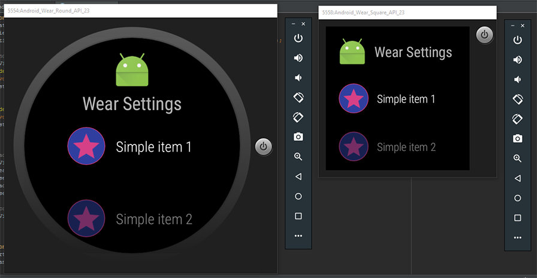

WearSettings
=======

A library for easy implementaion of WearableListView with header view




Sample
--------

```java
    @Override
    protected void onCreate(Bundle savedInstanceState) {
        super.onCreate(savedInstanceState);
        WearableSettingListView settingListView = new WearableSettingListView(this);

        // Set styles in XML or Java
        settingListView.setTextColor(Color.CYAN);
        settingListView.setImageTintColor(Color.CYAN);
        settingListView.setCircleBackgroundColor(Color.MAGENTA);
        settingListView.setCircleBorderColor(Color.CYAN);
        settingListView.setCircleBorderWidth(getResources().getDimensionPixelSize(R.dimen.circle_border_width));

        // Click handler for SimpleSettingsItems and HeaderView
        settingListView.setClickListener(new WearableSettingListView.ClickListener() {
            @Override
            public void onHeaderClicked() {
            }

            @Override
            public void onSimpleItemClicked(SimpleSettingsItem simpleSettingsItem) {
                // Do something with selected item
                Toast.makeText(SecondActivity.this, simpleSettingsItem.title, Toast.LENGTH_SHORT).show();
                finish();
            }
        });
        
        // Add a HeaderView to the list
		View headerView = settingListView.inflateHeaderView(R.layout.list_header);
        headerView.findViewById(android.R.id.icon).setVisibility(View.GONE);
        ((TextView) headerView.findViewById(android.R.id.title)).setTextColor(Color.CYAN);
        ((TextView) headerView.findViewById(android.R.id.title)).setText("Option title");
		
        // Add any combination of SettingsItems (Simple, PendingIntent, BoolPref)
        settingListView.setSettingsItems(getSettingsItems());
        setContentView(settingListView);
    }

    @NonNull
    private List<SettingsItem> getSettingsItems() {
        List<SettingsItem> items = new ArrayList<>();
        items.add(new SimpleSettingsItem(R.drawable.ic_action_star, "Item 1"));
        items.add(new SimpleSettingsItem(R.drawable.ic_action_star, "Item 2"));
        items.add(new SimpleSettingsItem(R.drawable.ic_action_star, "Item 3"));
        items.add(new BoolPrefSettingsItem(R.drawable.ic_action_star, "Boolean preference", "my_pref_key"));
        items.add(new PendingIntentSettingsItem(R.drawable.ic_action_star, "PendingIntent activity", PendingIntent.getActivity(this, 0, new Intent(this, NextActivity.class), 0)));
        items.add(new PendingIntentSettingsItem(R.drawable.ic_action_star, "PendingIntent broadcast", PendingIntent.getBroadcast(this, 0, new Intent(ACTION_DO_SOMETHING), 0)));
        return items;
    }
```


License
--------

    Copyright 2016 Gaelan Bolger

    Licensed under the Apache License, Version 2.0 (the "License");
    you may not use this file except in compliance with the License.
    You may obtain a copy of the License at

       http://www.apache.org/licenses/LICENSE-2.0

    Unless required by applicable law or agreed to in writing, software
    distributed under the License is distributed on an "AS IS" BASIS,
    WITHOUT WARRANTIES OR CONDITIONS OF ANY KIND, either express or implied.
    See the License for the specific language governing permissions and
    limitations under the License.
