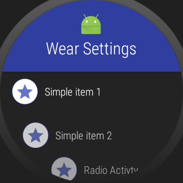
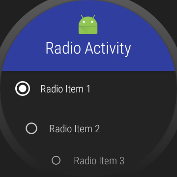
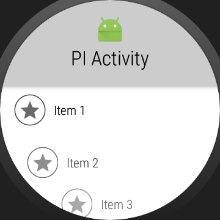
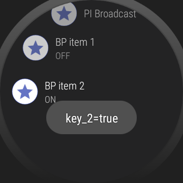

WearSettings
=======

A library for easy implementaion of WearableRecyclerView with header view







Include
--------

```groovy
    compile 'day.cloudy.apps.wear.settings:wear-settings:2.0.0'
```


Example
--------

```java
    @Override
    protected void onCreate(Bundle savedInstanceState) {
        super.onCreate(savedInstanceState);
        setContentView(R.layout.activity_main);
        SettingsRecyclerView settingsRecyclerView = findViewById(R.id.settings_recycler_view);

        // Set up the header
        settingsRecyclerView.setHeaderIcon(R.mipmap.ic_launcher);
        settingsRecyclerView.setHeaderText(R.string.app_name);

        // Add any combination of SettingsItems (Simple, Radio, PendingIntent, BoolPref), initial
        // selection, and an optional click handler for SimpleSettingsItems and HeaderView
        settingsRecyclerView.setSettingsItems(getSettingsItems(), 0, new SettingsRecyclerView.OnClickListener() {
            @Override
            public void onHeaderClick() {
                toast("Header clicked");
            }

            @Override
            public void onSimpleItemClick(int position, SimpleSettingsItem item) {
                if (position == 2)
                    startActivity(new Intent(MainActivity.this, RadioActivity.class));
                else
                    toast(item.title);
            }
        });
    }

    @Override
    protected void onStart() {
        super.onStart();
        PreferenceManager.getDefaultSharedPreferences(this).registerOnSharedPreferenceChangeListener(this);
    }

    @Override
    protected void onStop() {
        super.onStop();
        PreferenceManager.getDefaultSharedPreferences(this).unregisterOnSharedPreferenceChangeListener(this);
    }

    @Override
    public void onSharedPreferenceChanged(SharedPreferences sharedPreferences, String key) {
        Toast.makeText(MainActivity.this, key + "=" + sharedPreferences.getBoolean(key, false), Toast.LENGTH_SHORT).show();
    }

    @NonNull
    private List<SettingsItem> getSettingsItems() {
        List<SettingsItem> settingsItems = new ArrayList<>();
        settingsItems.add(new SimpleSettingsItem(R.drawable.ic_action_star, "Simple item 1"));
        settingsItems.add(new SimpleSettingsItem(R.drawable.ic_action_star, "Simple item 2"));
        settingsItems.add(new SimpleSettingsItem(R.drawable.ic_action_star, "Radio Activty"));
        settingsItems.add(new PendingIntentSettingsItem(R.drawable.ic_action_star, "PI Activity",
                PendingIntent.getActivity(this, 0, new Intent(this, PIActivity.class), 0)));
        settingsItems.add(new PendingIntentSettingsItem(R.drawable.ic_action_star, "PI Broadcast",
                PendingIntent.getBroadcast(this, 0, new Intent(PIReceiver.ACTION_MAKE_TOAST), 0)));
        settingsItems.add(new BoolPrefSettingsItem(R.drawable.ic_action_star, "BP item 1", "key_1"));
        settingsItems.add(new BoolPrefSettingsItem(R.drawable.ic_action_star, "BP item 2", "key_2"));
        return settingsItems;
    }
```

```xml
    <day.cloudy.apps.wear.settings.view.SettingsRecyclerView
        android:id="@+id/settings_recycler_view"
        android:layout_width="match_parent"
        android:layout_height="match_parent"
        app:ws_circle_border_color="@color/colorPrimary"
        app:ws_circle_color="@android:color/white"
        app:ws_image_tint="@color/colorPrimary"
        app:ws_summary_text_color="?android:attr/textColorSecondary"
        app:ws_title_text_color="?android:attr/textColorPrimary" />
```
		
		
License
--------

    Copyright 2017 Gaelan Bolger

    Licensed under the Apache License, Version 2.0 (the "License");
    you may not use this file except in compliance with the License.
    You may obtain a copy of the License at

       http://www.apache.org/licenses/LICENSE-2.0

    Unless required by applicable law or agreed to in writing, software
    distributed under the License is distributed on an "AS IS" BASIS,
    WITHOUT WARRANTIES OR CONDITIONS OF ANY KIND, either express or implied.
    See the License for the specific language governing permissions and
    limitations under the License.
